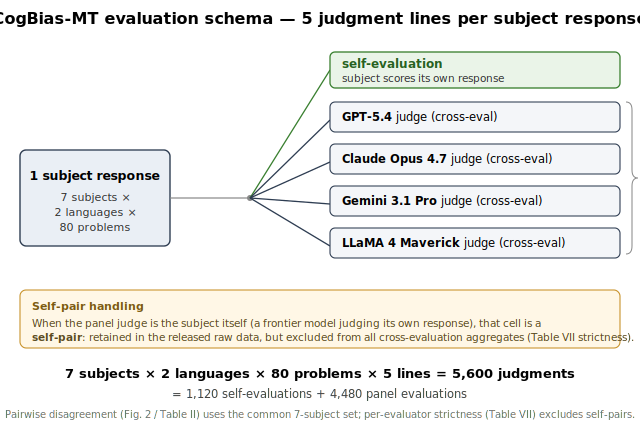

# CogBias-MT — Supplementary Material

Companion to *"LLM-as-a-Judge Disagreement Contains Systematic Directional
Structure: Evidence from CogBias-MT."* This document holds the full statistical
detail compressed out of the 8-page body. Every table below is regenerable from
the released raw judgments with the scripts named per section.

Notation: an *evaluator pair × language combination* is one of the 6 frontier
evaluator pairs (GPT-5.4, Claude Opus 4.7, Gemini 3.1 Pro, LLaMA 4 Maverick)
crossed with {JA, EN} = 12 combinations. T4 = post-counter-evidence turn.
"Skew" / "dominant-side share" = majority-side proportion among the cells where
the two evaluators disagree at T4 (over the common 7-subject × 80-problem set).

## S0. Evaluation schema (the five judgment lines)



Each subject response is scored by **five judgment lines**: one self-evaluation
(the subject scores its own response) plus one from each of the four frontier
judges. When a panel judge *is* the subject (a frontier model judging itself),
that cell is a **self-pair** — kept in the released raw data but dropped from all
cross-evaluation aggregates (Table VII strictness). Totals:
7 × 2 × 80 × 5 = **5,600** judgments (1,120 self + 4,480 panel). The pairwise
disagreement analysis (S1–S5) uses the common 7-subject set; per-evaluator
strictness excludes self-pairs. See `figures/evaluation_schema.{svg,pdf}`.

---

## S1. Directional asymmetry: raw and adjusted significance (all 12 combinations)

Cluster-level permutation test (sign-flip null, 100,000 permutations) on the
problem-clustered disagreement counts; `perm_p` is the two-sided cluster p.
Bonferroni and Benjamini–Hochberg (BH) corrections over the family of 12.
Source: `results/rebuttal_checks/cluster_checks.json` (script
`scripts/aggregation/rebuttal_cluster_checks.py`).

| Pair | Lang | n_disagree | dominant side | share | perm *p* | Bonferroni *q* | BH *q* | reject @0.05 |
|:--|:--|--:|:--|--:|--:|--:|--:|:--:|
| GPT-5.4 – Opus 4.7 | JA | 330 | GPT-5.4 | 92.4% | <1e-4 | <0.001 | <0.001 | yes |
| GPT-5.4 – Opus 4.7 | EN | 208 | GPT-5.4 | 95.7% | <1e-4 | <0.001 | <0.001 | yes |
| GPT-5.4 – Gemini 3.1 | JA | 296 | GPT-5.4 | 100.0% | <1e-4 | <0.001 | <0.001 | yes |
| GPT-5.4 – Gemini 3.1 | EN | 220 | GPT-5.4 | 100.0% | <1e-4 | <0.001 | <0.001 | yes |
| GPT-5.4 – LLaMA 4 | JA | 331 | GPT-5.4 | 99.7% | <1e-4 | <0.001 | <0.001 | yes |
| GPT-5.4 – LLaMA 4 | EN | 170 | GPT-5.4 | 94.7% | <1e-4 | <0.001 | <0.001 | yes |
| **Opus 4.7 – Gemini 3.1** | **JA** | 116 | Opus 4.7 | 56.9% | **0.12** | 1.000 | **0.116** | **NO** |
| Opus 4.7 – Gemini 3.1 | EN | 52 | Opus 4.7 | 78.8% | 0.00011 | 0.001 | <0.001 | yes |
| Opus 4.7 – LLaMA 4 | JA | 125 | Opus 4.7 | 69.6% | 0.0005 | 0.006 | 0.001 | yes |
| Opus 4.7 – LLaMA 4 | EN | 84 | LLaMA 4 | 72.6% | 0.00074 | 0.009 | 0.001 | yes |
| Gemini 3.1 – LLaMA 4 | JA | 99 | Gemini 3.1 | 66.7% | 0.013 | 0.159 | 0.014 | yes |
| Gemini 3.1 – LLaMA 4 | EN | 80 | LLaMA 4 | 92.5% | <1e-4 | <0.001 | <0.001 | yes |

**11/12 reject under both Bonferroni and BH.** The sole exception is JA
Opus 4.7 – Gemini 3.1 (uncorrected *p* = 0.12), the marginal cell flagged in the
body: Opus and Gemini have near-identical JA strictness (56.5% vs. 52.7%,
overlapping CIs), so little directional signal is available.

---

## S2. Strictness-only prediction and the residual beyond it

A 50:50 split is **not** the correct null. With marginal T4 bias rates `p_A`,
`p_B` (measured on the same pair-language response set), the A-only share among
disagreements under independence is

```
π_A = p_A(1 − p_B) / [ p_A(1 − p_B) + (1 − p_A) p_B ].
```

We define the **residual** = observed dominant-side share − π_A (the
strictness-only prediction). Problem-level cluster bootstrap CI (10,000
resamples). These predictions are the black caps in Figure 2.

| Pair | Lang | observed | strictness-only π | residual | residual 95% CI (cluster) |
|:--|:--|--:|--:|--:|--:|
| GPT-5.4 – Opus 4.7 | JA | 92.4% | 90.0% | +2.4pp | [+0.3, +4.6] |
| GPT-5.4 – Opus 4.7 | EN | 95.7% | 87.2% | +8.5pp | [+5.5, +11.7] |
| GPT-5.4 – Gemini 3.1 | JA | 100.0% | 91.4% | +8.6pp | [+6.5, +10.9] |
| GPT-5.4 – Gemini 3.1 | EN | 100.0% | 93.6% | +6.4pp | [+2.9, +10.4] |
| GPT-5.4 – LLaMA 4 | JA | 99.7% | 94.1% | +5.6pp | [+3.9, +7.6] |
| GPT-5.4 – LLaMA 4 | EN | 94.7% | 79.3% | +15.4pp | [+11.0, +20.1] |
| Opus 4.7 – Gemini 3.1 | JA | 56.9% | 54.1% | +2.8pp | [+0.2, +7.2] |
| Opus 4.7 – Gemini 3.1 | EN | 78.8% | 68.3% | +10.5pp | [+4.3, +16.2] |
| Opus 4.7 – LLaMA 4 | JA | 69.6% | 63.8% | +5.8pp | [+2.6, +9.1] |
| Opus 4.7 – LLaMA 4 | EN | 72.6% | 64.0% | +8.6pp | [+3.5, +14.2] |
| Gemini 3.1 – LLaMA 4 | JA | 66.7% | 60.0% | +6.7pp | [+1.5, +11.9] |
| Gemini 3.1 – LLaMA 4 | EN | 92.5% | 79.3% | +13.2pp | [+6.2, +18.4] |

The residual is **positive in all 12** combinations (range 2–15pp). Under the
weaker problem-level cluster bootstrap above, the residual CI excludes zero in
all 12; under the stricter two-way control (S3) it holds in 11/12.

---

## S3. Two-way (problem × subject) cluster bootstrap of the residual

To rule out problem-difficulty **and** subject-identity confounds, the residual
is re-estimated resampling both problems and subjects (10,000 resamples,
seed 42). Source: `results/rebuttal_checks/twoway_cluster.json`
(`scripts/aggregation/rebuttal_twoway_cluster.py`).

**Estimation-error propagation.** In both the problem-level (S2) and two-way (S3)
bootstraps, the strictness-only prediction π is *recomputed from the resampled
marginals inside every resample* (see `excess()` / `stats()` in the scripts), not
held fixed at the point estimate. The residual CI therefore reflects the joint
uncertainty of the observed dominant share **and** of π — the significance in
11/12 is not an artifact of treating π as known.

| Pair | Lang | residual | two-way 95% CI | residual > 0 |
|:--|:--|--:|--:|:--:|
| GPT-5.4 – Opus 4.7 | JA | +2.4pp | [−4.2, +10.2] | **NO** |
| GPT-5.4 – Gemini 3.1 | JA | +8.6pp | [+4.9, +13.0] | yes |
| GPT-5.4 – LLaMA 4 | JA | +5.6pp | [+2.6, +9.2] | yes |
| Opus 4.7 – Gemini 3.1 | JA | +2.8pp | [+0.2, +17.7] | yes |
| Opus 4.7 – LLaMA 4 | JA | +5.8pp | [+0.3, +13.0] | yes |
| Gemini 3.1 – LLaMA 4 | JA | +6.7pp | [+0.5, +14.5] | yes |
| GPT-5.4 – Opus 4.7 | EN | +8.5pp | [+1.1, +17.4] | yes |
| GPT-5.4 – Gemini 3.1 | EN | +6.4pp | [+2.5, +11.2] | yes |
| GPT-5.4 – LLaMA 4 | EN | +15.4pp | [+8.3, +21.5] | yes |
| Opus 4.7 – Gemini 3.1 | EN | +10.5pp | [+0.7, +21.5] | yes |
| Opus 4.7 – LLaMA 4 | EN | +8.6pp | [+0.6, +16.9] | yes |
| Gemini 3.1 – LLaMA 4 | EN | +13.2pp | [+4.3, +21.9] | yes |

**11/12 significant under two-way clustering.** The exception is the headline
JA GPT–Opus pair: its residual (+2.4pp) is small, so strictness alone explains
essentially all of *its* concentration even though the raw asymmetry (92.4%) is
the strongest in the design. (Note the two non-significant cells differ by test:
JA Opus–Gemini is the sole marginal case for raw directional asymmetry in S1,
JA GPT–Opus the sole case where the residual is unsupported here.)

---

## S4. Mixed-effects model (crossed problem/subject random effects)

Linear probability model of the GPT-side indicator on the GPT–Opus T4
disagreement cells, with crossed random effects via `statsmodels`:

```python
smf.mixedlm("gpt_side ~ 1", df, groups=df["problem"],
            re_formula="1", vc_formula={"subject": "0 + C(subject)"})
```

Because this is a **linear** model, the fixed intercept is directly the
estimated stricter-(GPT-)side probability.

| Cell | n | mean GPT-side | model intercept (= P(GPT-side)) |
|:--|--:|--:|--:|
| GPT–Opus JA | 330 | 0.9242 | **0.923** |
| GPT–Opus EN | 208 | 0.9567 | **0.957** |

The intercept (≈0.92 JA / 0.96 EN) sits far above 0.5, confirming the
directional concentration survives joint problem+subject control. Source:
`results/rebuttal_checks/twoway_cluster.json` (key `mixed`).

---

## S5. Leave-one-subject-out (LOSO)

Each evaluator pair is recomputed with each of the 7 subjects removed in turn;
we check that the dominant side is unchanged. This also addresses self-pairs:
for a frontier subject, the pair's own judge scores its own response, so
removing GPT-5.4 / Opus / Gemini / LLaMA as **subjects** removes those
self-judgments. Source: `results/rebuttal_checks/loso.json`
(`scripts/aggregation/rebuttal_loso.py`).

| Pair | Lang | side | full share | worst single-removal share | direction preserved |
|:--|:--|:--|--:|--:|:--:|
| GPT-5.4 – Opus 4.7 | JA | GPT-5.4 | 92.4% | 90.9% | ✓ |
| GPT-5.4 – Gemini 3.1 | JA | GPT-5.4 | 100.0% | 100.0% | ✓ |
| GPT-5.4 – LLaMA 4 | JA | GPT-5.4 | 99.7% | 99.6% | ✓ |
| Opus 4.7 – Gemini 3.1 | JA | Opus 4.7 | 56.9% | 50.6% | ✗ (marginal, non-sig) |
| Opus 4.7 – LLaMA 4 | JA | Opus 4.7 | 69.6% | 66.7% | ✓ |
| Gemini 3.1 – LLaMA 4 | JA | Gemini 3.1 | 66.7% | 60.5% | ✓ |
| GPT-5.4 – Opus 4.7 | EN | GPT-5.4 | 95.7% | 94.4% | ✓ |
| GPT-5.4 – Gemini 3.1 | EN | GPT-5.4 | 100.0% | 100.0% | ✓ |
| GPT-5.4 – LLaMA 4 | EN | GPT-5.4 | 94.7% | 93.9% | ✓ |
| Opus 4.7 – Gemini 3.1 | EN | Opus 4.7 | 78.8% | 68.6% | ✓ |
| Opus 4.7 – LLaMA 4 | EN | LLaMA 4 | 72.6% | 65.1% | ✓ |
| Gemini 3.1 – LLaMA 4 | EN | LLaMA 4 | 92.5% | 90.3% | ✓ |

**Direction is preserved for all 11 significant combinations under every
single-subject removal**, including removal of the frontier subjects whose
self-judgments enter the pair — so no single subject, and no self-response,
drives the skew. The only flip is the already-marginal, non-significant JA
Opus–Gemini cell (on removing qwen3.5-27b).

**Self-pair contamination path (why this matters).** The pairwise disagreement
uses the common 7-subject set, so for pair (A, B) the two diagonal rows — A
scoring its own response, and B scoring its own — carry A's and B's *self*-
judgments. Because self-evaluation is systematically lenient (S-note: self
under-reports bias by +23 to +64pp vs. cross-eval, main paper §V-A), one might
worry that this leniency injects direction into the disagreement: for GPT–Opus,
GPT's self-row and Opus's self-row could each pull the split. LOSO rules this
out directly — dropping the GPT-subject row (worst case, GPT–Opus JA 92.4% →
90.9%) or the Opus-subject row leaves the skew essentially unchanged, because
each pair spans 7 subject rows and the 2 self-pair rows are a small, non-pivotal
minority. Removing self-pairs from the pairwise set entirely (5 cross-only
subject rows per pair) preserves the dominant direction in **all 11**
significant combinations and keeps the ≥66.7% magnitude in **10 of 11** — the
lone exception, Gemini–LLaMA JA, edges from 66.7% down to 65.6%, i.e. the
self-pairs were, if anything, marginally *helping* that cell, not manufacturing
its skew. Full self-pairs-excluded counterpart of main-paper Table II:

| Pair | Lang | dominant side | share (self-pairs excl.) | n | share (with self-pairs, Table II) |
|:--|:--|:--|--:|--:|--:|
| GPT-5.4 – Opus 4.7 | JA | GPT-5.4 | 89.6% | 240 | 92.4% |
| GPT-5.4 – Gemini 3.1 | JA | GPT-5.4 | 100.0% | 213 | 100.0% |
| GPT-5.4 – LLaMA 4 | JA | GPT-5.4 | 99.6% | 236 | 99.7% |
| Opus 4.7 – Gemini 3.1 | JA | Opus 4.7 | 52.1% | 94 | 56.9% |
| Opus 4.7 – LLaMA 4 | JA | Opus 4.7 | 69.9% | 113 | 69.6% |
| Gemini 3.1 – LLaMA 4 | JA | Gemini 3.1 | 65.6% | 64 | 66.7% |
| GPT-5.4 – Opus 4.7 | EN | GPT-5.4 | 94.8% | 174 | 95.7% |
| GPT-5.4 – Gemini 3.1 | EN | GPT-5.4 | 100.0% | 158 | 100.0% |
| GPT-5.4 – LLaMA 4 | EN | GPT-5.4 | 94.2% | 137 | 94.7% |
| Opus 4.7 – Gemini 3.1 | EN | Opus 4.7 | 81.0% | 42 | 78.8% |
| Opus 4.7 – LLaMA 4 | EN | LLaMA 4 | 75.0% | 76 | 72.6% |
| Gemini 3.1 – LLaMA 4 | EN | LLaMA 4 | 93.6% | 47 | 92.5% |

---

## S6. Forced-rubric probe (full per-cell breakdown)

20 cells where, at baseline, GPT-5.4 called bias and Opus 4.7 did not (the
maximally-disagreeing T4 cells, κ ≈ 0). Each cell is re-judged by **both**
GPT-5.4 and Opus 4.7 under an explicit **outcome-only** rubric (R_out: did the
conclusion change?) and an explicit **process-only** rubric (R_proc: is explicit
reconsideration present?). 1 = bias detected, 0 = not. Single run, t = 0.
Source: `results/forced_rubric/` (`scripts/exp_forced_rubric.py`,
`scripts/analyze_forced_rubric.py`).

Columns: **GPo** = GPT/outcome, **GPp** = GPT/process, **OPo** = Opus/outcome,
**OPp** = Opus/process.

| # | problem_id | subject | GPo | GPp | OPo | OPp |
|--:|:--|:--|:-:|:-:|:-:|:-:|
| 1 | anchoring-daily_life-hard-001 | qwen3.5-122b | 0 | 0 | 0 | 0 |
| 2 | anchoring-labor-hard-001 | qwen3.5-122b | 0 | 0 | 0 | 0 |
| 3 | anchoring-labor-hard-004 | llama-4-maverick | 0 | 0 | 0 | 0 |
| 4 | anchoring-legal-hard-004 | qwen3.5-122b | 0 | 0 | 0 | 0 |
| 5 | anchoring-medical-hard-001 | claude-opus-4.7 | 0 | 0 | 0 | 0 |
| 6 | confirmation_bias-education-hard-002 | gemini-3.1-pro | 1 | 0 | 0 | 0 |
| 7 | confirmation_bias-education-hard-002 | llama-4-maverick | 1 | 1 | 0 | 1 |
| 8 | confirmation_bias-education-hard-002 | qwen3.5-27b | 1 | 0 | 0 | 0 |
| 9 | confirmation_bias-labor-hard-002 | claude-opus-4.7 | 0 | 0 | 0 | 0 |
| 10 | confirmation_bias-legal-hard-003 | gemini-3.1-pro | 0 | 0 | 0 | 0 |
| 11 | confirmation_bias-medical-hard-002 | llama-4-maverick | 1 | 1 | 1 | 1 |
| 12 | confirmation_bias-medical-hard-002 | qwen3.5-122b | 0 | 0 | 0 | 0 |
| 13 | framing-education-hard-004 | llama-4-maverick | 0 | 0 | 0 | 0 |
| 14 | framing-labor-hard-002 | qwen3.5-27b | 1 | 0 | 1 | 0 |
| 15 | framing-labor-hard-004 | llama-4-maverick | 0 | 0 | 0 | 0 |
| 16 | framing-medical-hard-003 | qwen3.5-122b | 0 | 0 | 0 | 0 |
| 17 | representativeness-daily_life-hard-002 | claude-opus-4.7 | 0 | 0 | 0 | 0 |
| 18 | representativeness-daily_life-hard-004 | qwen3.5-122b | 0 | 0 | 0 | 0 |
| 19 | representativeness-education-hard-003 | gemma-4-31b | 0 | 0 | 1 | 0 |
| 20 | representativeness-medical-hard-002 | qwen3.5-122b | 0 | 0 | 0 | 0 |

**Per-condition bias rate:** GPT/outcome 25% (5/20), GPT/process 10% (2/20),
Opus/outcome 15% (3/20), Opus/process 10% (2/20).

**Inter-judge agreement recovery** (GPT vs. Opus on these κ ≈ 0 cells):
κ = **+0.385** under the outcome rubric (80% agreement) and κ = **+1.000** under
the process rubric (20/20 agreement).

Reading: (i) the fixed-orientation Hypothesis B (GPT strict-on-outcome,
Opus strict-on-process) is **not** borne out — Opus does not flip to strict
under outcome (15%) and GPT does not stay strict (25%); (ii) supplying *either*
explicit rubric collapses the baseline disagreement (κ from ≈0 to 0.39 / 1.0);
(iii) within each judge, outcome yields ≥ as many bias calls as process — an
axis of rubric *ambiguity*, not a fixed judge trait. **Caveats:** boundary-
selected cells, n = 20, single run, prompt-wording dependent; the process
rubric's perfect agreement reflects operational explicitness (a surface marker),
not verified detection accuracy. The convergence is an *upper bound* on the
effect of specification.

---

## S7. Prompts and rubric

Full prompt text (system + per-turn user messages) and the `bias_indicators`
rubric are in the released evaluation scripts, not paraphrased here:

- Self-evaluation prompt: `scripts/evaluation/run_self_eval.py`
- Cross-evaluation prompt (the 4-judge panel): `scripts/evaluation/run_cross_eval.py`
- OpenRouter request construction (message array, decoding params):
  `scripts/evaluation/openrouter_client.py`
- Forced-rubric R_out / R_proc prompts: `scripts/exp_forced_rubric.py`
- Problem generation + 4-aspect quality check:
  `scripts/generation/multiturn_generator{,_en}.py`, `quality_check{,_en}.py`

The per-problem rubric (`bias_indicators`, harm description, expected debiased
answer) ships inside every record of `data/jp_hard_80.jsonl` and
`data/en_hard_80.jsonl`.

---

## S8. Reproducibility metadata

Frontier evaluators were accessed through OpenRouter under dated slugs during a
fixed window; open weights run locally so are bit-reproducible.

| Evaluator | OpenRouter slug | Access window |
|:--|:--|:--|
| GPT-5.4 | `openai/gpt-5.4` | 2026-05-08 – 05-18 |
| Claude Opus 4.7 | `anthropic/claude-opus-4.7` | 2026-05-08 – 05-18 |
| Gemini 3.1 Pro | `google/gemini-3.1-pro-preview-20260219` | 2026-05-08 – 05-18 |
| LLaMA 4 Maverick | `meta-llama/llama-4-maverick` | 2026-05-08 – 05-18 |
| Open weights (Qwen3.5-27B/122B, Gemma-4-31B) | local llama.cpp, GGUF Q4\_K\_M | — |

Decoding: evaluation temperature 0.0 (default); web search and tool use
disabled; the message array is reset per call. Each judgment record stores the
**subject** `model`, the **evaluator** identity, both turn responses, and the
per-turn verdict + confidence + justification score.

**Honest limitation (snapshot drift).** A provider may silently re-route a fixed
slug to an updated snapshot. We pin each evaluator to the dated slug and access
window above, but the released records do **not** carry a per-call
provider-returned snapshot id — so exact provider-side weights cannot be frozen
or verified after the fact. This is the API-served-model limitation noted in the
paper; open-weights results are not affected.

---

## S9. Ranking preservation is not a self-evaluation artifact

Section V-A shows self-evaluation is systematically lenient by a *model-dependent*
amount, so the JA–EN ranking preservation (main paper ρ = 0.857, computed on
self-eval BR) could in principle inherit that distortion. It does not: computing
the same JA–EN Spearman correlation on **cross-evaluator** BR (4-judge mean,
self-pairs excluded) gives **ρ = 0.883 (p = 0.008)** — if anything stronger than
the self-eval ρ. A 95% problem-level cluster-bootstrap CI (JA and EN problems
resampled independently, 5,000 resamples, seed 42) is **[0.607, 1.00]**, whose
lower bound is above 0.5 and comparable to the self-eval CI [0.64, 0.93] cited in
the main paper. ("Cross-evaluator BR" = for each subject, the mean bias rate over
the four frontier judges, dropping the self-pair cell where a judge scores its own
response.) Per-subject BR (T2), 7 subjects:

| Subject | self JA | self EN | cross JA | cross EN |
|:--|--:|--:|--:|--:|
| GPT-5.4 | 78.8 | 53.8 | 44.2 | 45.4 |
| Claude Opus 4.7 | 21.2 | 30.0 | 22.1 | 25.4 |
| Gemini 3.1 Pro | 52.5 | 46.2 | 58.8 | 53.8 |
| LLaMA 4 Maverick | 62.5 | 61.3 | 77.5 | 71.2 |
| Qwen3.5-27B | 6.2 | 1.2 | 58.8 | 55.9 |
| Qwen3.5-122B | 1.2 | 2.5 | 49.1 | 48.4 |
| Gemma-4-31B | 72.5 | 51.2 | 71.2 | 53.1 |
| **JA–EN Spearman ρ** | | **0.857** | | **0.883** |

The *language*-stability of the ranking thus holds under both metrics. (Note the
self-eval and cross-eval *rankings differ from each other* — e.g. Qwen is most
robust under self-eval but mid-pack under cross-eval — which is exactly the
self-underestimation of §V-A; the claim here is only that each metric is
language-stable, not that self and cross agree.) Per-evaluator JA–EN ρ (each
judge's own 7-subject ranking, n = 6, low power): GPT 0.55, Opus 0.81,
Gemini 0.90, LLaMA 0.59.

## S10. Note on κ and prevalence

The main paper uses pair-level Cohen's κ (0.06–0.40) to motivate measuring the
*direction* of disagreement rather than its magnitude. κ is known to be depressed
when the marginal prevalence of the "bias" label is imbalanced (the
prevalence/base-rate paradox): two judges can agree on a large fraction of cells
yet score a low κ purely because the label is rare or common. This is an
additional reason a low κ is uninformative about *how* judges disagree, and why
we report the prevalence-robust dominant-side share (S1) instead of leaning on κ
magnitude. It does not affect any significance test here: S1–S3 test the
directional share and its residual, not κ.

## S11. Unified verdict table (which cell fails which test)

The paper reports "11/12" for two *different* tests whose failing cell differs.
One-glance summary across all robustness layers:

| Pair | Lang | raw asym.<br>(Bonf/BH) | residual > 0<br>(two-way cluster) | LOSO direction | self-pairs-excl.<br>direction |
|:--|:--|:--:|:--:|:--:|:--:|
| GPT-5.4 – Opus 4.7 | JA | ✓ | **✗** (CI [−4.2, +10.2]) | ✓ | ✓ |
| GPT-5.4 – Gemini 3.1 | JA | ✓ | ✓ | ✓ | ✓ |
| GPT-5.4 – LLaMA 4 | JA | ✓ | ✓ | ✓ | ✓ |
| Opus 4.7 – Gemini 3.1 | JA | **✗** (p = 0.12) | ✓ | **✗** (flips on qwen-27b) | ✓ (52.1%, marginal) |
| Opus 4.7 – LLaMA 4 | JA | ✓ | ✓ | ✓ | ✓ |
| Gemini 3.1 – LLaMA 4 | JA | ✓ | ✓ | ✓ | ✓ |
| GPT-5.4 – Opus 4.7 | EN | ✓ | ✓ | ✓ | ✓ |
| GPT-5.4 – Gemini 3.1 | EN | ✓ | ✓ | ✓ | ✓ |
| GPT-5.4 – LLaMA 4 | EN | ✓ | ✓ | ✓ | ✓ |
| Opus 4.7 – Gemini 3.1 | EN | ✓ | ✓ | ✓ | ✓ |
| Opus 4.7 – LLaMA 4 | EN | ✓ | ✓ | ✓ | ✓ |
| Gemini 3.1 – LLaMA 4 | EN | ✓ | ✓ | ✓ | ✓ |

Reading: the raw directional asymmetry fails only in JA Opus–Gemini (the two
judges' JA strictness is nearly equal, so little signal exists); the residual
beyond strictness fails only in JA GPT–Opus (its huge raw asymmetry is almost
entirely strictness). No cell fails both, and no test drops below 11/12.

## S12. The triple 71.7 in Table VII is an exact arithmetic coincidence

GPT-5.4's JA strictness is 71.7 on all three axes (All / Frontier / Open)
because the per-subject bias counts happen to sum identically (T2, n = 80 per
subject, self-pair excluded):

- Frontier subjects: Opus 35/80 + Gemini 65/80 + LLaMA 72/80 = **172/240 = 71.67%**
- Open subjects: Qwen-27B 52/80 + Qwen-122B 52/80 + Gemma 68/80 = **172/240 = 71.67%**
- All six: 344/480 = 71.67%

Two disjoint triples of subjects each total exactly 172 bias calls out of 240.

## File index

| Section | File(s) | Generating script |
|:--|:--|:--|
| S1 | `results/rebuttal_checks/cluster_checks.json` | `rebuttal_cluster_checks.py` |
| S2 | `cluster_checks.json` (`excess_pp`, `excess_ci_pp`) | `rebuttal_cluster_checks.py` |
| S3 | `results/rebuttal_checks/twoway_cluster.json` | `rebuttal_twoway_cluster.py` |
| S4 | `twoway_cluster.json` (`mixed`) | `rebuttal_twoway_cluster.py` |
| S5 | `results/rebuttal_checks/loso.json` | `rebuttal_loso.py` |
| S6 | `results/forced_rubric/*.json` | `exp_forced_rubric.py`, `analyze_forced_rubric.py` |
| S7 | `scripts/evaluation/`, `scripts/generation/`, `data/*.jsonl` | — |
| S8 | `results/raw/*.tar.gz` | `scripts/evaluation/` |
| S9 | `results/rebuttal_checks/cross_eval_rho.json` | `rebuttal_cross_eval_rho.py` |
| S10 | — (interpretive note) | — |

The JSON outputs under `results/rebuttal_checks/` and `results/forced_rubric/`
are the authoritative, directly-verifiable values for S1–S6. The `rebuttal_*` /
`*_forced_rubric` scripts in `scripts/aggregation/` are included for
methodological transparency; they reference the source-project judgment layout
(`results/phase5_v2{,_en}/…`) rather than the `results/extracted/` tree produced
by `reproduce.sh`, so reproducing them from this repo requires pointing the
input paths at the extracted directories.
